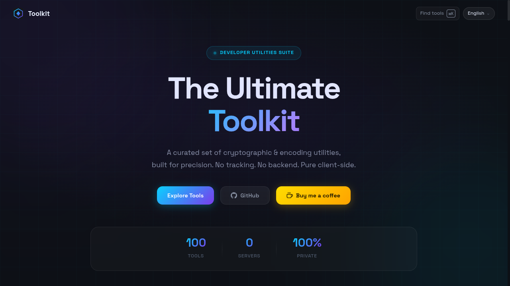
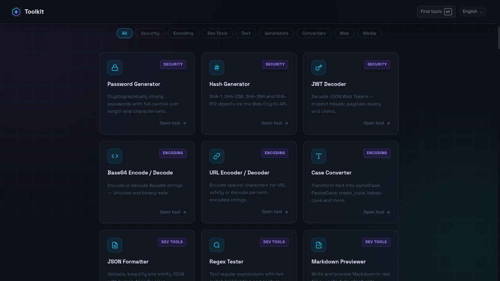
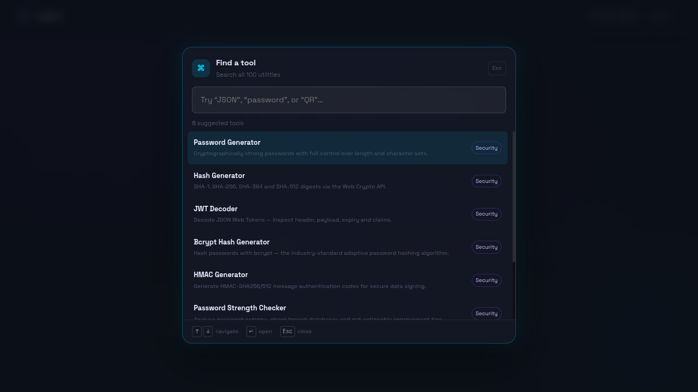
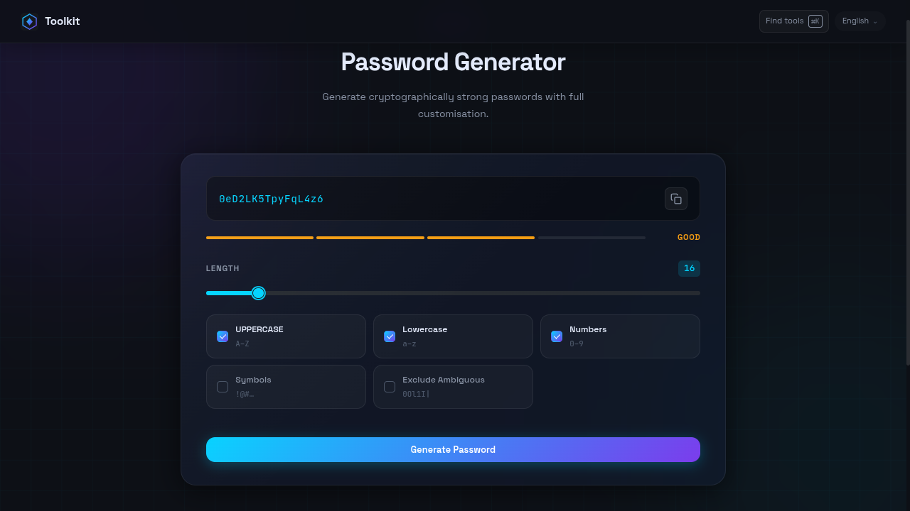

<div align="center">


# Toolkit

### 100 privacy-first developer utilities that run entirely in your browser.

[](https://abel0x.github.io/toolkit/)
[](https://abel0x.github.io/toolkit/#tools)
[](LICENSE)
[](#privacy-and-offline)

**[Open Toolkit](https://abel0x.github.io/toolkit/)** · [Browse tools](https://abel0x.github.io/toolkit/#tools) · [Contributing](CONTRIBUTING.md) · [Security](SECURITY.md)

</div>

---

## What it is

Toolkit is a static collection of developer utilities for the everyday work that should not require uploading data to a third party: encoding, cryptography, data conversion, text work, web inspection, image handling, and more.

- **Private by design.** Tool input is processed on-device with browser APIs such as Web Crypto, FileReader, Canvas, and `Intl`.
- **Offline after the first successful load.** The service worker precaches the published application so its tools remain usable without a network connection.
- **Fast to navigate.** Press <kbd>Ctrl</kbd>/<kbd>Cmd</kbd> + <kbd>K</kbd> to search the full catalogue from any page.
- **Bilingual interface.** English is the default. Turkish is available from the language menu, and an explicit choice is remembered locally in that browser.
- **No accounts or telemetry.** There is no backend, analytics service, or tool-input persistence.

> A small amount of interface state can be stored locally: the selected language and optional recent-tool slugs. Tool input, generated results, and uploaded files are not persisted by Toolkit.

## Tool catalogue

The live site is the complete, searchable catalogue of all 100 tools. The current distribution is:

| Area | Tools | Examples |
| --- | ---: | --- |
| Security | 14 | Passwords, SHA/HMAC, AES-GCM, RSA, TOTP, certificates |
| Encoding | 9 | Base64, Base32, URL, HTML, Hex, Binary |
| Dev Tools | 28 | JSON, CSV, XML, regex, cron, CSS, HTTP, WCAG contrast |
| Text Tools | 10 | Word count, diff, Unicode, slug, find and replace |
| Generators | 9 | UUID, QR, gradients, colours, fake data |
| Converters | 10 | Timestamp, time zone, date duration, units, bytes |
| Web Utilities | 11 | URL, meta tags, CSP, cURL, HTTP headers, sitemap |
| Media | 9 | Image metadata, compression, SVG, QR reader, favicon |

### Latest additions

The expansion from 78 to 100 tools added fully browser-based utilities for:

- **Security:** AES-GCM Encryptor, RSA Key Pair Generator, PEM / JWK Converter, Certificate Inspector, and TOTP Generator.
- **Web:** CSP Generator, cURL Builder, HTTP Header Analyzer, and Sitemap Generator.
- **Development:** Cron Expression Assistant, Unix Permissions, CSS Specificity and Clamp calculators, JSON to TypeScript, JSON to Markdown, XML to JSON, CSV Viewer, and Color Contrast Checker.
- **Everyday work:** Unicode Inspector, Time Zone Converter, Date Duration Calculator, and Image Compressor.

## Screenshots

<div align="center">



<p><strong>Main</strong> — a privacy-first landing page with direct access to the full toolkit.</p>

<table>
  <tr>
    <td width="50%" valign="top">
      
      <p align="center"><strong>Category</strong><br />Browse the catalogue by area.</p>
    </td>
    <td width="50%" valign="top">
      
      <p align="center"><strong>Finder</strong><br />Find any utility with <kbd>Ctrl</kbd>/<kbd>Cmd</kbd> + <kbd>K</kbd>.</p>
    </td>
  </tr>
  <tr>
    <td colspan="2" valign="top">
      
      <p align="center"><strong>Password</strong><br />A focused tool page with local-only password generation.</p>
    </td>
  </tr>
</table>

</div>

## Privacy and offline

Toolkit is hosted as static files on GitHub Pages. It has no application server, database, authentication, or API used to process tool input. The app uses local browser capabilities where possible:

| Need | Browser capability |
| --- | --- |
| Hashes, HMAC, AES-GCM, RSA | Web Crypto API |
| Files and image metadata | FileReader and browser file APIs |
| Image resize/compression | Canvas API |
| Time-zone rendering | `Intl` and browser locale data |
| Offline availability | Service Worker and Cache Storage |

Some tools use self-hosted vendor scripts for QR-code support; they are part of the published offline cache and do not call a third-party service.

## Run locally

There is no runtime build, package manager, bundler, or framework. A local HTTP server is enough:

```bash
git clone https://github.com/abel0x/toolkit.git
cd toolkit
python3 -m http.server 8080
```

Open [http://localhost:8080](http://localhost:8080). Serving over HTTP (instead of opening files directly) gives the browser access to the service worker and avoids file-origin restrictions.

## Deployment

The repository includes a GitHub Actions deployment workflow at `.github/workflows/deploy-pages.yml`. Every push to `main` and every manual workflow dispatch will:

1. refresh generated navigation, static tool counts, and the offline precache manifest;
2. run the static publication audit; and
3. upload and deploy the verified static artifact to GitHub Pages.

To enable it once in GitHub, open **Settings → Pages**, choose **GitHub Actions** as the publishing source, then push or run **Deploy Toolkit to GitHub Pages** from the Actions tab. The deployment environment reports the resulting site URL; for this repository it is `https://abel0x.github.io/toolkit/`.

## Quality checks

The repository includes a small, dependency-free maintenance helper and static/browser checks. From the project root:

```bash
# Regenerate static navigation, visible tool-count text, and offline precache entries.
python3 build.py --nav --tool-count --offline

# Check published pages, references, assets, and tool metadata.
node tests/site-audit.mjs

# Exercise the 22 expansion tools in Firefox across desktop, mobile, and i18n flows.
node tests/expansion-e2e.mjs
```

The browser check starts and stops its own local server. See [CONTRIBUTING.md](CONTRIBUTING.md) for the full contributor workflow.

## Project layout

```text
toolkit/
├── index.html                    # Hub, filters, and tool catalogue
├── tools/                        # 100 individual static tool pages
├── _includes/_nav.html           # Shared navigation source
├── assets/
│   ├── css/
│   │   ├── core.css              # Tokens, reset, base rules
│   │   ├── components.css        # Shared controls and components
│   │   ├── compatibility.css     # Legacy tool compatibility rules
│   │   ├── pages/                # Home and tool page layouts
│   │   └── features/             # Feature-specific styles
│   ├── js/
│   │   ├── core/                 # Navigation, i18n, metadata, finder
│   │   ├── pages/                # Page-specific controllers
│   │   ├── tools/                # Tool implementations
│   │   └── vendor/               # Self-hosted browser libraries
│   ├── fonts/                    # Self-hosted fonts
│   └── images/                   # Favicons and screenshots
├── tests/                        # Static audit and browser E2E checks
├── build.py                      # Repeatable maintenance tasks
├── sw.js                         # Offline cache worker
└── sitemap.xml                   # Published URL index
```

### Localisation model

English source text lives in the HTML and JavaScript source. `assets/js/core/i18n.js` supplies the runtime and shared translations; `assets/js/core/i18n-expansion.js` contains the larger Turkish catalogue for tool pages and expansion controls. New visible copy must have a Turkish translation before it is merged. The selected language is read from and written to `localStorage` only after a user changes it.

## Contributing

Toolkit accepts focused improvements that keep the following promise intact: local processing, offline usability, clear accessibility, and no external application dependency. Please read [CONTRIBUTING.md](CONTRIBUTING.md) before opening a pull request and [SECURITY.md](SECURITY.md) for responsible disclosure guidance.

## License

Copyright © 2024–2026 abel0x. Toolkit is licensed under the [Apache License 2.0](LICENSE).

<div align="center">

Built with HTML · CSS · Vanilla JavaScript · Web Crypto API

[GitHub](https://github.com/abel0x/toolkit) · [Buy me a coffee](https://buymeacoffee.com/abel0x)

</div>
